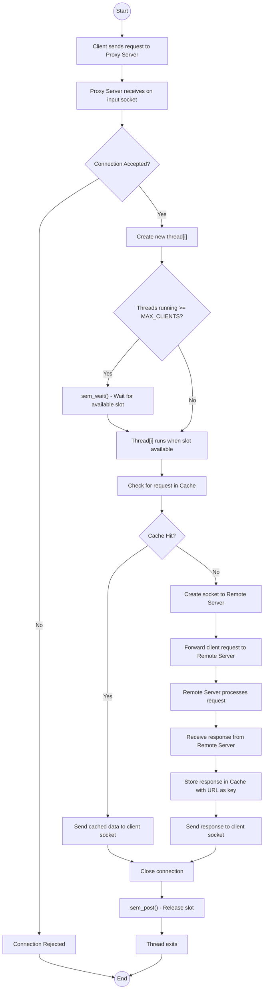

# HTTP Proxy Server with LRU Cache

## Architecture



A multi-threaded HTTP proxy server written in C that caches responses using an LRU (Least Recently Used) eviction policy.

## Features

- Multi-threaded request handling with semaphore-based connection limiting
- LRU cache for storing HTTP responses
- Thread-safe cache operations using mutex locks
- Configurable cache size and element limits
- HTTP error response handling (400, 403, 404, 500, 502, 503, 505)

## How It Works

1. Client connects to the proxy server
2. Proxy checks if the requested URL exists in cache
3. If cached, the response is served directly from memory
4. If not cached, the proxy forwards the request to the remote server
5. The response is cached and sent back to the client
6. When cache is full, the least recently used entry is removed

## Building

```bash
make
```

## Usage

Start the proxy server on a specific port:

```bash
./proxy <port>
```

Example:

```bash
./proxy 8080
```

## Testing

Use curl with the proxy flag to send requests through the proxy:

```bash
curl -x http://localhost:8080 http://example.com
curl -x http://localhost:8080 http://httpbin.org/get
```

Note: This proxy only supports HTTP. HTTPS requests will not work.

## Configuration

The following constants can be modified in the source code:

- `MAX_BYTES` - Maximum buffer size (default: 4096)
- `MAX_CLIENTS` - Maximum concurrent connections (default: 10)
- `MAX_ELEMENT_SIZE` - Maximum size of a single cache entry (default: 10KB)
- `MAX_SIZE` - Maximum total cache size (default: 200MB)

## Files

- `proxy_server_with_cache.c` - Main proxy server implementation
- `proxy_parse.c` - HTTP request parser
- `proxy_parse.h` - Parser header file
- `Makefile` - Build configuration

## Limitations

- Only supports HTTP GET requests
- Does not handle HTTPS/TLS connections
- No persistent connections (Connection: close)
